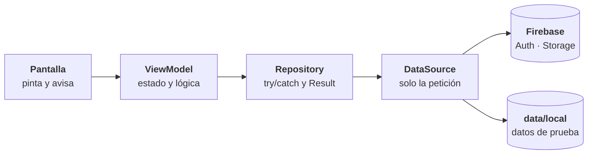

<p align="center">
  
</p>

<h1 align="center">Mixtapp</h1>

<p align="center"><b>Califica, reseña y descubre álbumes con la gente a la que sigues.</b></p>

<p align="center">
  
  
  
  
  
  
  
</p>

Mixtapp es una app Android donde abres un álbum, le pones de 0 a 5 estrellas, escribes tu reseña
y ves lo que publican las personas a las que sigues. Está escrita en Kotlin con Jetpack Compose,
una sola Activity y arquitectura en capas sobre Firebase. Es el proyecto semestral de Computación
Móvil de la Pontificia Universidad Javeriana.

> [!NOTE]
> La autenticación y las imágenes son reales contra Firebase. Las reseñas, los álbumes y la
> actividad social todavía viven en memoria: los `object` de `data/local/` hacen de base de datos
> falsa detrás de los data sources, así que la capa de arriba no se entera cuando entre la real.

[Estado](#estado) · [Arquitectura](#arquitectura) · [Decisiones](#decisiones) ·
[Cómo ejecutarlo](#cómo-ejecutarlo) · [Estructura](#estructura) · [Equipo](#equipo)

## Estado

| Módulo | Estado |
|---|---|
| Registro, inicio de sesión y sesión persistente con Firebase Auth | Funcionando |
| Mensajes de error en español según el tipo de fallo | Funcionando |
| Foto de perfil subida a Firebase Storage | Funcionando |
| Portadas y avatares por URL con Coil | Funcionando |
| Navegación entre las 12 rutas | Funcionando |
| Calificar, guardar, dar me gusta y comentar | Funcionando, en memoria |
| Filtros de Inicio y Siguiendo, categorías de Buscar | Funcionando, en memoria |
| Persistencia de reseñas y álbumes | Pendiente |
| Modo claro | Pendiente: falta diseñar cómo se ven las pantallas en claro |
| Tipografía propia del tema | Pendiente |

La autenticación se probó en el emulador con ocho escenarios: credenciales incorrectas, correo
inexistente, correo ya registrado, contraseña débil, sesión persistente, cierre de sesión, bloqueo
por intentos y sin conexión.

## Arquitectura

Dos capas, UI y datos. La capa de dominio queda fuera.



**El data source** declara la petición y devuelve lo que pidió quien llama. Nada más.
**El repositorio** hace el `try`/`catch`, traduce cada excepción de Firebase a una propia y
devuelve un `Result<T>` del mismo tipo. **El ViewModel** mira `result.isSuccess`, toma uno de los
dos caminos y ahí vive la lógica: filtrar, ordenar y decidir qué se muestra. **La pantalla** pinta
y avisa. El ViewModel nunca ve una excepción de Firebase.

| Qué | Con qué |
|---|---|
| UI | Jetpack Compose · Material 3 · Coil |
| Estado | ViewModel · `MutableStateFlow` · un `UiState` por pantalla |
| Navegación | Navigation Compose · un `NavHost` · rutas en `sealed class` |
| Datos | Firebase Auth · Firebase Storage · corrutinas con `suspend` y `viewModelScope` |
| Inyección | Dagger Hilt con KSP |
| Build | Gradle Kotlin DSL · `libs.versions.toml` |

## Decisiones

- **La navegación no entra al ViewModel.** Las pantallas reciben lambdas `onXClick` y las resuelve
  `AppNavigation.kt`. La única excepción es `BottomNav`, que existe solo para navegar.
- **A las pantallas de detalle les llega el id, no el objeto.** El ViewModel busca la entidad y la
  pantalla decide qué pintar si no existe.
- **Un solo `Album`.** No está repetido por pantalla: las demás entidades lo referencian.
- **Un solo `Scaffold`**, en `Mixtapp.kt`, con la barra inferior y el botón flotante en sus ranuras.
  `NavigationLogic` decide en qué rutas se ven.
- **Una sola calificación por álbum.** Al publicar, el repositorio busca la reseña que ya existe
  para ese álbum: si la encuentra la actualiza y si no la crea.
- **El color sale del `MaterialTheme`.** Los 36 roles del esquema llevan la paleta del Figma y no
  hay un solo color quemado fuera de `Color.kt`.
- **Hilt solo declara `FirebaseAuth` y `FirebaseStorage`**; el resto de la cadena se resuelve por
  `@Inject constructor`.
- **La app es solo oscura.** El esquema claro existe como plantilla, pero no se aplica hasta que
  estén diseñadas las pantallas en modo claro.
- **Hay callbacks vacíos a propósito** — ajustes, más opciones y responder un comentario apuntan a
  pantallas que todavía no se han creado.

## Cómo ejecutarlo

Necesitas Android Studio, JDK 11 y un emulador o dispositivo con **Android 8.0 o superior**
(`minSdk 26`). El `google-services.json` ya viene en `app/`, así que no hay que configurar nada.

```bash
git clone https://github.com/AndresContreras1/Mixtapp.git
```

Abre la carpeta en Android Studio, espera a que Gradle sincronice y dale a **Run**. Desde la
terminal, `./gradlew assembleDebug` (en Windows `gradlew.bat assembleDebug`).

<details>
<summary>Dos ajustes en la consola de Firebase</summary>

Sin ellos, dos de los mensajes de error nunca salen:

1. **Authentication → Settings → Protección contra enumeración de correos: desactivada.** Mientras
   esté activa, Firebase no distingue "no existe la cuenta" de "contraseña incorrecta".
2. **Authentication → Settings → Política de contraseñas → Exigir aplicación**, con mayúscula y
   número. En modo *Notificar* el registro se acepta igual.

</details>

## Estructura

```text
app/src/main/java/com/example/mixtapp/
├── data/
│   ├── datasource/      Auth · Storage · Album · Review · Social
│   ├── injection/       FirebaseHiltModule
│   ├── local/           proveedores de datos de prueba
│   ├── model/           las entidades del dominio
│   └── repository/      los repositorios y AppExceptions
├── navigation/          AppNavigation (NavHost) · NavigationLogic · Screen
├── ui/
│   ├── components/      lo que comparten dos o más pantallas
│   ├── screens/<x>/     XScreen · XState · XViewModel · components/ · model/
│   └── theme/           Color · Theme · Type
├── MainActivity.kt      @AndroidEntryPoint
└── Mixtapp.kt           Scaffold + barra + botón flotante + AppNavigation
```

Los diagramas de clases y de entidad-relación están en `Docs/`.


Proyecto de **Computación Móvil**, Pontificia Universidad Javeriana, sede Bogotá.
Profesor: Juan Sebastián Angarita Torres.


Ramas cortas desde `master` actualizado, una por bloque de trabajo, y un pull request por rama.
Los mensajes de commit van en español, sin tildes, con prefijo `feat:`, `fix:`, `refactor:`,
`style:`, `chore:` o `docs:`.
