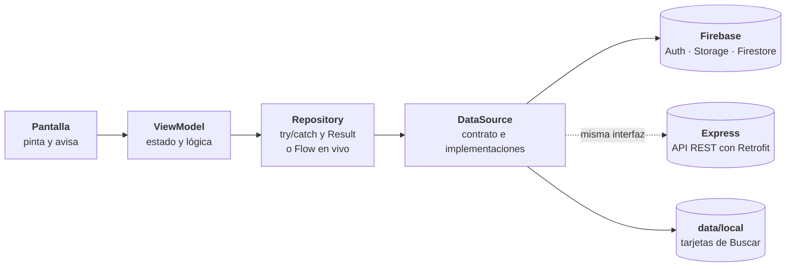

<p align="center">
  
</p>

<h1 align="center">Mixtapp</h1>

<p align="center"><b>Califica, reseña y descubre álbumes, canciones y artistas con la gente a la que sigues.</b></p>

<p align="center">
  
  
  
  
  
  
  
  
</p>

Mixtapp es una app Android donde abres un álbum, una canción o un artista, le pones de 0 a 5
estrellas, escribes tu reseña y ves lo que publican las demás personas. Le das me gusta a lo que te
gusta (de ahí salen tus favoritos y el inicio **Para ti**), guardas lo que quieres escuchar después,
lees sus datos curiosos, comentas las reseñas, sigues a otros usuarios y recibes una notificación
cuando alguien interactúa contigo. El catálogo es real: portadas, géneros y el Top Colombia de
Deezer. Está escrita en Kotlin con Jetpack
Compose, una sola Activity y arquitectura en capas sobre Firebase (Authentication, Storage, Cloud
Firestore y Cloud Messaging). Es el proyecto semestral de Computación Móvil de la Pontificia
Universidad Javeriana.

> [!NOTE]
> El catálogo (álbumes, canciones y artistas), las reseñas, los perfiles, los likes, los guardados,
> los seguidores y las notificaciones viven en **Cloud Firestore**.
> La capa de datos tiene una segunda implementación con **Retrofit** contra el backend de Express
> ([mixtapp-backend](https://github.com/AndresContreras1/mixtapp-backend)): las dos cumplen el mismo
> contrato y se cambia de una a otra con una línea por contrato en `DataSourceModule`. Las funciones en línea
> (integridad de los datos y notificaciones) están en su propio proyecto,
> [mixtapp-functions](https://github.com/AndresContreras1/mixtapp-functions).

[Estado](#estado) · [Arquitectura](#arquitectura) · [Datos en Firestore](#datos-en-firestore) ·
[Notificaciones](#notificaciones) · [Decisiones](#decisiones) · [Cómo ejecutarlo](#cómo-ejecutarlo) ·
[Estructura](#estructura)

## Estado

| Módulo | Estado |
|---|---|
| Registro, inicio de sesión y sesión persistente con Firebase Auth | Funcionando |
| Al registrarse, el nombre, el usuario y el token de notificaciones quedan guardados en Firestore | Funcionando |
| Catálogo de álbumes, canciones y artistas reales, con portadas de 1000 px, géneros, datos curiosos y el Top Colombia | Funcionando, Firestore (seed en mixtapp-functions) |
| Inicio con **Para ti**, **Tendencias** y **Seguidos**: la tarjeta En tendencia, filas de canciones, álbumes y artistas populares y las reseñas de quienes sigo, **en tiempo real** | Funcionando, Firestore |
| **Para ti** mezcla los géneros de mis me gusta, en proporción a cuántos tengo de cada uno | Funcionando |
| Buscar: catálogo y personas por texto, tarjetas por fecha de lanzamiento, más populares, mejor calificados y por género | Funcionando, Firestore |
| Detalle de un álbum, una canción o un artista: promedio, total de calificaciones, % que lo recomienda, me gusta, guardar y sus reseñas, **en tiempo real** | Funcionando, Firestore |
| Datos curiosos de cada álbum, canción y artista, en su propia pantalla | Funcionando, Firestore |
| Escribir, modificar y eliminar mi reseña desde el detalle, mi perfil y Mis reseñas | Funcionando, Firestore |
| Me gusta a un álbum, una canción o un artista: queda en mis Favoritos | Funcionando, Firestore |
| Guardar un álbum, una canción o un artista: queda en la pestaña Guardados de mi perfil | Funcionando, Firestore |
| Mi perfil con pestañas Perfil (favoritos, actividad reciente y cerrar sesión), Guardados, Seguidores y Siguiendo | Funcionando, Firestore |
| Perfil de cualquier otro usuario con sus favoritos y sus reseñas | Funcionando, Firestore |
| Dar y quitar like a una reseña y a un comentario, con el total de likes | Funcionando, Firestore |
| Seguir y dejar de seguir, con el total de seguidores y seguidos | Funcionando, Firestore |
| Discusión de una reseña: comentarios, respuestas y likes a cada comentario, **en tiempo real**. Se abre desde cualquier tarjeta de reseña, aunque no sigas a quien la escribió | Funcionando, Firestore |
| Pantalla de notificaciones (me gusta, comentarios, respuestas y seguidores nuevos), **en tiempo real** y marcadas como leídas | Funcionando, Firestore y Cloud Functions |
| Notificación push de las mismas acciones | FCM y Cloud Functions, con el Firebase real (en modo debug las funciones no corren) |
| Foto de perfil subida a Firebase Storage | Funcionando |
| Consumo del backend de Express con Retrofit | Implementado, intercambiable con Firestore |
| Modo claro y modo oscuro: la app sigue el del celular | Funcionando |
| Modo debug contra el emulador de Firebase (Firebase CLI) | Funcionando |
| Catálogo y datos falsos con Faker para el emulador o el Firebase real | Script en [mixtapp-functions](https://github.com/AndresContreras1/mixtapp-functions) |
| Pruebas de integración de los data sources y los repositorios contra el emulador | 21 + 17 pruebas |
| Pruebas con mocks (MockK) del repositorio, con sus mapeos, y de los ViewModels | 12 + 11 pruebas, más 15 de mapeos y datos locales |
| Pruebas de integración del ViewModel de registro contra el emulador | 2 pruebas |
| Pruebas end to end de los dos casos de uso del sprint 13 | 2 pruebas |

## Arquitectura

Dos capas, UI y datos. La capa de dominio queda fuera.


```mermaid
flowchart LR
    S["<b>Pantalla</b><br/>pinta y avisa"]
    V["<b>ViewModel</b><br/>estado y lógica"]
    R["<b>Repository</b><br/>try/catch y Result<br/>o Flow en vivo"]
    D["<b>DataSource</b><br/>contrato e implementaciones"]
    F[("<b>Firebase</b><br/>Auth · Storage · Firestore")]
    E[("<b>Express</b><br/>API REST con Retrofit")]
    L[("<b>data/local</b><br/>tarjetas de Buscar")]

    S --> V --> R --> D
    D --> F
    D -. "misma interfaz" .-> E
    D --> L
```

**El data source** declara la petición y devuelve el DTO de su base. Cada contrato
(`AlbumRemoteDataSource`, `CancionRemoteDataSource`, `ArtistaRemoteDataSource`,
`ReviewRemoteDataSource`, `UsuarioRemoteDataSource` y `NotificacionRemoteDataSource`) tiene una
implementación en `impl/firestore` y otra en `impl/retrofit`. Si el documento no existe, el data
source retorna `null` y el repositorio decide el error. Los repositorios reciben el contrato y
`DataSourceModule` dice con `@Binds` qué implementación entrega Hilt. **El repositorio** hace el
`try`/`catch`, mapea el DTO al modelo de la pantalla, organiza varios data sources (por ejemplo,
`CatalogoRepository` junta los álbumes, las canciones, los artistas y sus reseñas, y la reseña lleva
una copia del usuario y del item) y devuelve un `Result<T>`. El mapeo deja los números y las fechas
listos para la pantalla: 14 929 likes se ven como `14K` y la fecha como `3 h`. Para los datos en vivo
devuelve un `Flow` y los errores llegan al `catch` del ViewModel. **El ViewModel** mira
`result.isSuccess` (o recolecta el flujo con `collect`), toma uno de los dos caminos y ahí vive la
lógica: filtrar, ordenar y decidir qué se muestra. **La pantalla** pinta y avisa.

| Qué | Con qué |
|---|---|
| UI | Jetpack Compose · Material 3 · Coil · Google Fonts |
| Estado | ViewModel · `MutableStateFlow` · un `UiState` por pantalla |
| Navegación | Navigation Compose · un `NavHost` · rutas en `sealed class` |
| Datos | Firebase Auth · Storage · Cloud Firestore · Cloud Messaging · Retrofit · corrutinas con `suspend`, `viewModelScope` y `Flow` |
| Inyección | Dagger Hilt con KSP: `FirebaseHiltModule`, `AppModule` y `DataSourceModule` |
| Build | Gradle Kotlin DSL · `libs.versions.toml` · `BuildConfig` para el modo debug |
| Pruebas | JUnit · Truth · MockK · `runTest` y `StandardTestDispatcher` · Compose UI Test · Hilt testing · emulador de Firebase |

## Datos en Firestore

| Colección | Documento | Campos |
|---|---|---|
| `usuarios` | el uid de Authentication | `username`, `nombre` (texto) · `bio`, `fotoUrl` (texto o null) · `followersCount`, `followingCount` (número) · `fcmtoken` (texto) |
| `usuarios/<uid>/followers` | el uid de quien me sigue | `timestamp` |
| `usuarios/<uid>/following` | el uid de quien sigo | `timestamp` |
| `usuarios/<uid>/likes` | el id del item | `tipo`, `titulo`, `subtitulo`, `imagenUrl`, `genero`, `createdAt` (texto): la copia del item que me gusta |
| `usuarios/<uid>/guardados` | el id del item | los mismos campos: la copia del item que guardé |
| `usuarios/<uid>/notificaciones` | id aleatorio | `tipo` (`like`, `comentario`, `respuesta` o `seguidor`) · `actorId`, `actorNombre`, `actorFotoUrl` · `reviewId`, `itemTitulo`, `imagenUrl` (texto o null) · `leida` (booleano) · `createdAt` (texto ISO). Las escriben las Cloud Functions |
| `albumes` | `album_<nombre>` | `titulo`, `artista`, `portadaUrl`, `genero`, `subgenero` (texto) · `anio`, `likesCount` (número) · `tendencia` (número o null) · `datosCuriosos` (arreglo de texto) |
| `canciones` | `cancion_<nombre>` | los del álbum más `albumId` y `album` (el nombre del álbum) |
| `artistas` | `artista_<nombre>` | `nombre`, `fotoUrl`, `genero`, `subgenero` (texto) · `grupo` (texto o null) · `likesCount` (número) · `tendencia` (número o null) · `datosCuriosos` (arreglo de texto) |
| `albumes/<id>/likes`, `canciones/<id>/likes`, `artistas/<id>/likes` | el uid de quien dio like | `timestamp` |
| `reviews` | id aleatorio | `usuarioId`, `itemId`, `tipo` (texto) · `calificacion` (número) · `comentario` (texto) · `fechaEscucha` (texto `AAAA-MM-DD` o null) · `createdAt`, `updatedAt` (texto ISO) · `likesCount`, `commentsCount` (número) · `usuario` y `item` (mapas) |
| `reviews/<id>/likes` | el uid de quien dio like | `timestamp` |
| `reviews/<id>/comments` | id aleatorio | `usuarioId`, `contenido` (texto) · `parentCommentId` (texto o null) · `likesCount` (número) · `createdAt` (texto ISO) · `usuario` (mapa) |
| `reviews/<id>/comments/<id>/likes` | el uid de quien dio like | `timestamp` |

Los tipos tienen que coincidir con los DTO: `toObject` falla si `anio` o `calificacion` no son
número, y `whereEqualTo` no encuentra reseñas si `itemId` o `usuarioId` se guardan como número. El id
de cada item lleva su tipo adelante (`album_`, `cancion_`, `artista_`), así que una reseña se busca
solo con `itemId` y no se mezclan las de un álbum con las de una canción.

- El correo y la contraseña se quedan en Authentication; en Firestore no se guardan.
- Firestore no tiene joins, así que cada reseña guarda una copia de lo que se muestra con ella:
  `usuario` (`nombre`, `fotoUrl`) e `item` (`titulo`, `subtitulo`, `imagenUrl`). Los likes y los
  guardados de un usuario también guardan la copia del item, para pintar Favoritos y Guardados sin
  otra consulta.
- Si alguien cambia su nombre o su foto, la Cloud Function `updateUserInfoInReviews` actualiza esa
  copia en todas sus reseñas y en sus comentarios. Así las copias no quedan viejas.

### Likes y seguidores

Los likes y los seguidores son relaciones muchos a muchos, así que van en **subcolecciones** y no
como listas de ids dentro del documento: una lista crecería sin límite y cada consulta traería ids
que la tarjeta no usa. La tarjeta solo necesita el número, que vive en el documento principal
(`likesCount`, `followersCount`, `followingCount`).

- **Dar o quitar like** es una sola función: dentro de una **transacción** lee
  `reviews/<id>/likes/<mi uid>`. Si existe, lo borra y resta 1 a `likesCount`; si no, lo crea con
  `FieldValue.serverTimestamp()` y suma 1. Si una de las dos escrituras falla, Firebase deshace la
  otra.
- **Me gusta a un álbum, una canción o un artista** son tres escrituras en una transacción: el
  like en el item, la copia del item en `usuarios/<uid>/likes` y su `likesCount`. Mis likes son mis
  **Favoritos** y, con sus géneros, el inicio **Para ti**.
- **Guardar** crea o borra `usuarios/<uid>/guardados/<id del item>` en una transacción, para que dos
  toques seguidos no lo guarden dos veces. El detalle escucha ese documento y el marcador cambia solo.
- **Seguir** son cuatro escrituras en la misma transacción: `following/<B>` en A,
  `followers/<A>` en B, `followingCount` de A y `followersCount` de B.
- **Si ya di like o ya lo sigo** sale de buscar mi uid en la subcolección con `exists()`. El data
  source recibe `currentUserId` como parámetro opcional, para que Retrofit no lo tenga que usar.
- **La UI no copia el estado a mano.** La transacción cambia el contador del documento, eso
  dispara el listener de la pantalla y llegan el corazón o el botón y el contador ya confirmados,
  en este celular y en los demás.
- **Si la cuenta no tiene documento** en `usuarios` (el registro entró aunque falló Firestore, o
  el emulador se reinició y la sesión siguió en el celular), el repositorio lo crea antes de seguir
  y al iniciar sesión, con la parte del correo antes de la arroba como usuario.
- **La lista de seguidores o de seguidos** escucha la subcolección y trae el documento de cada
  usuario a la vez. Se abre al tocar el contador en cualquier perfil.

### Comentarios de la discusión

Cada reseña tiene su discusión. Los comentarios van en la subcolección `reviews/<id>/comments` y
la reseña guarda el total en `commentsCount`, igual que los likes.

- **Comentar** es una transacción: crea el comentario y suma 1 a `commentsCount`. El comentario
  guarda una copia de mi nombre y mi foto, como la reseña.
- **Responder** guarda el id del comentario principal en `parentCommentId`. El repositorio arma el
  hilo: cada comentario principal va seguido de sus respuestas.
- **Dar like a un comentario** es la misma transacción que el like de la reseña, en
  `comments/<id>/likes/<mi uid>` con su `likesCount`.
- **En tiempo real:** la discusión escucha la reseña y sus comentarios con dos `callbackFlow`, y
  `combine` la arma cada vez que llega cualquiera de los dos. Es como un chat: un comentario desde
  otro celular aparece sin recargar.
- **Borrar la reseña** borra a mano sus likes y sus comentarios (con los likes de cada uno), porque
  Firestore no borra las subcolecciones.

Para comprobarlo con dos cuentas:

1. Dar like a una reseña: en la consola aparece `reviews/<id>/likes/<uid>` y `likesCount` sube.
   Quitarlo borra el documento y el contador baja.
2. Seguir un perfil: aparecen `following` en mi usuario y `followers` en el otro, con los dos
   contadores. Tocar el contador abre la lista.
3. Con el filtro **Seguidos** del inicio, escribir una reseña desde la otra cuenta: aparece sola,
   sin recargar.
4. Abrir la misma discusión en los dos celulares y comentar desde uno: el comentario y el total
   aparecen en el otro. Responder un comentario lo deja debajo del que responde.

## Notificaciones

La app usa **Firebase Cloud Messaging**. `MyFirebaseMessagingService` está en
`data/datasource/services` y declarado en el manifiesto con el permiso `POST_NOTIFICATIONS`. En
Android 13 o superior, `Mixtapp.kt` pide el permiso al abrir la app (solo si todavía no está
concedido). El token del celular se guarda en `usuarios/<uid>.fcmtoken` al registrarse y al iniciar
sesión.

Las crean tres Cloud Functions de
[mixtapp-functions](https://github.com/AndresContreras1/mixtapp-functions):
`sendLikeNotification` («Nuevo me gusta»), `sendFollowNotification` («Nuevo seguidor») y
`sendCommentNotification` («Nuevo comentario» al autor de la reseña y «Nueva respuesta» al autor
del comentario que se responde). Cada una guarda la notificación en `usuarios/<uid>/notificaciones`
y, si el usuario tiene token, envía el push. La pantalla de notificaciones escucha esa subcolección
en vivo, la agrupa en Hoy y Antes, y al tocar una la marca leída y abre la reseña o el perfil. Para
que el push llegue en las pruebas, la app debe estar en segundo plano o cerrada.

## Decisiones

- **La navegación no entra al ViewModel.** Las pantallas reciben lambdas `onXClick` y las resuelve
  `AppNavigation.kt`. La única excepción es `BottomNav`, que existe solo para navegar.
- **A las pantallas de detalle les llega el id, no el objeto.** El ViewModel busca la entidad y la
  pantalla decide qué pintar si no existe.
- **Un solo `Scaffold`**, en `Mixtapp.kt`, con la barra inferior (Inicio, Buscar y Perfil) y el
  botón flotante en sus ranuras. `NavigationLogic` decide en qué rutas se ven. El botón **+** abre
  el catálogo para elegir qué calificar.
- **Un solo detalle para álbumes, canciones y artistas.** La ruta lleva el tipo y el id
  (`detail/{tipo}/{itemId}`, como `followList`) y el repositorio escucha el data source de ese tipo.
  Los datos curiosos usan la misma ruta en su pantalla.
- **Una sola calificación por item.** La pantalla de escribir carga mi reseña de ese item si ya
  existe: si llega su id se modifica y si no se crea.
- **Una sola tarjeta de reseña** (`ReviewCard`) para toda la app: el inicio, el detalle, los perfiles,
  Mis reseñas, Siguiendo y la discusión. El lápiz abre Escribir reseña y la papelera la elimina.
- **El promedio y el porcentaje que recomienda se calculan en el repositorio** con las reseñas de
  cada item.
- **Mi reseña la marca el repositorio.** Cada reseña llega con `isMine` (su `usuarioId` es mi uid),
  así el inicio, el detalle y la pantalla de escribir saben cuál es la mía sin otra petición.
- **Las filas del inicio las arma el ViewModel.** Para ti reparte 10 cupos entre los géneros de mis
  me gusta según cuántos tengo de cada uno, los intercala y completa con lo más popular. Tendencias
  ordena por el puesto en el Top Colombia, que viene guardado en el catálogo (no hay una API externa).
  Seguidos muestra lo que reseñaron los usuarios que sigo.
- **Las reseñas, los perfiles y la discusión están en tiempo real.** Cada data source escucha
  con `callbackFlow` y `addSnapshotListener`, el repositorio mapea el flujo y el ViewModel lo
  recolecta una sola vez con `catch` y `collect`. Están en vivo el inicio, Buscar, el detalle, la
  discusión, Siguiendo, mi perfil con sus pestañas, el perfil de otro usuario, Mis reseñas, las
  listas de seguidores y las notificaciones. Los formularios (escribir reseña, editar perfil) y los
  datos curiosos leen una sola vez.
- **Las corrutinas de cada ViewModel se lanzan en un dispatcher inyectado** (`@IoDispatcher`, que
  entrega `CoroutineModule`), así las pruebas pueden pasar uno de prueba.
- **El color sale del `MaterialTheme`.** `Color.kt` tiene las cuatro escalas de la paleta (Crimson,
  Mauve, Plum y Gris, del 50 al 600) y `Theme.kt` elige el tono de cada rol: para cambiar el tema
  basta con cambiar un tono en uno de los dos archivos. El modo oscuro usa los tonos pastel sobre el
  fondo de vino casi negro y el modo claro, los fondos pastel. No hay colores quemados fuera de
  `Color.kt`, salvo el fondo de la ventana en `themes.xml` y los drawables XML (icono y marcadores de
  imagen), que se pintan sin Compose y repiten a mano los colores de la paleta.
- **Un solo campo de texto** (`AppTextField`): un `OutlinedTextField` ovalado con el fondo
  translúcido, para que se vea el fondo con los círculos. Lo usan el login, el registro, Buscar, la
  fecha de escucha y los comentarios.
- **Tipografía de Google Fonts:** Playfair Display para los títulos e Inter para el texto. El
  certificado está en `res/values/font_certs.xml`. Sin internet, Android usa la fuente por defecto.
- **Hilt se compila con KSP.** El proyecto está en AGP 9.0.0, que trae Kotlin integrado (por eso no
  se aplica `kotlin.android`) y deja `kapt` solo como transición. El plugin de KSP ya estaba en el
  build de clase. `firebase-storage` reemplaza a `firebase-storage-ktx`: desde el BoM 32.5 son el
  mismo módulo.
- **Los errores de Firestore los traduce el repositorio**, igual que el `HttpException` del
  backend: sin conexión, documento que no existe o error del servidor.
- **La app sigue el modo del celular.** `MixtappTheme` elige el esquema claro u oscuro con
  `isSystemInDarkTheme()` y el dynamic color queda apagado.

## Cómo ejecutarlo

Necesitas Android Studio con JDK 21 (el que pide `gradle/gradle-daemon-jvm.properties`) y un
emulador o dispositivo con **Android 8.0 o superior** (`minSdk 26`). El `google-services.json` ya viene en `app/`.

```bash
git clone https://github.com/AndresContreras1/Mixtapp.git
```

Abre la carpeta en Android Studio y espera a que Gradle sincronice. **Debug** usa el emulador de
Firebase (ver abajo); **Play** con la variante *release* usa el Firebase real. Desde la terminal,
`./gradlew assembleDebug` (en Windows `gradlew.bat assembleDebug`).

<details>
<summary>Modo debug: el emulador de Firebase (Firebase CLI)</summary>

En debug, `BaseApplication` conecta Firestore y Authentication al emulador que corre en el
computador (`10.0.2.2` desde el emulador de Android): `if (BuildConfig.DEBUG)` con
`useEmulator("10.0.2.2", 8080)` y `useEmulator("10.0.2.2", 9099)`. Para eso el `build.gradle.kts`
tiene el tipo `debug` y `buildConfig = true`.

Hace falta Node.js. Desde [mixtapp-functions](https://github.com/AndresContreras1/mixtapp-functions),
que tiene los puertos en su `firebase.json`:

```bash
npm install -g firebase-tools
firebase emulators:start --only firestore,auth --project mixtapp-720eb
```

La interfaz queda en `http://127.0.0.1:4000/`, con las pestañas Authentication y Firestore. Los
datos se borran al cerrar la CLI: hay que registrarse otra vez o cargar los datos con Faker.

</details>

<details>
<summary>Catálogo y datos falsos con Faker</summary>

El script está en la carpeta `seed/` de
[mixtapp-functions](https://github.com/AndresContreras1/mixtapp-functions). Carga el catálogo real
de `catalogo.json` (24 álbumes, 46 canciones y 21 artistas de rock, metal, reggaetón y música
popular) y 12 usuarios de Faker con sus seguidores, me gusta, reseñas y comentarios, con los mismos
campos de la tabla de arriba. Por defecto escribe en el emulador; para el Firebase real se cambian
tres líneas. Las instrucciones están en ese README.

</details>

<details>
<summary>Pruebas con mocks (sin emulador)</summary>

Están en `app/src/test`, por capa. Corren en el computador, sin emulador: clic derecho en la carpeta
`test` → **Run 'Tests in…'**. MockK simula las capas de abajo (`mockk`, `coEvery { … } returns …`,
`any()`) y se prueba solo la capa de arriba.

| Clase | Pruebas | Qué revisa |
|---|---|---|
| `repository/CatalogoRepositoryTest` | 6 | el promedio, el total, el % que recomienda y mi calificación; la canción en tres líneas y sus likes como `1.2K`; el artista que no existe; el data source que falla; el like sin sesión; cada álbum del catálogo con sus reseñas |
| `repository/ReviewRepositoryTest` | 3 | mis reseñas de la última editada a la más vieja; la respuesta debajo de su comentario; la discusión de una reseña que no existe |
| `repository/UsuarioRepositoryTest` | 3 | el perfil con `bio` y `fotoUrl` nulas (quedan vacías); sin documento; la búsqueda no me incluye |
| `viewmodels/SignUpViewModelTest` | 4 | registro válido, contraseña de 4 caracteres, correo ya registrado y sin aceptar los términos |
| `viewmodels/LoginViewModelTest` | 2 | credenciales válidas y contraseña incorrecta |
| `viewmodels/WriteReviewViewModelTest` | 3 | sin texto, fecha con mes 13 y reseña válida |
| `viewmodels/DetailViewModelTest` | 2 | item que no existe y like sin conexión (el error es del botón, el item se sigue viendo) |
| `dtos/FormatosTest`, `dtos/InteraccionesSocialesTest`, `local/DatosLocalesTest` | 15 | `14K`, `3 h`, los contadores y las marcas del mapeo y los datos fijos de la app |

Los ViewModels reciben el dispatcher de prueba en el constructor (`@IoDispatcher`),
`Dispatchers.setMain` lo pone como principal y `advanceUntilIdle()` espera a que terminen sus
corrutinas antes de los asserts. En `build.gradle.kts`, `unitTests.isReturnDefaultValues = true`
hace que `Log.d` responda 0 en el computador, donde no hay Android.

</details>

<details>
<summary>Pruebas de integración</summary>

Están en `app/src/androidTest`, contra el emulador de Firebase: necesitan el emulador de Android
prendido y la Firebase CLI corriendo (`firebase emulators:start --only firestore,auth --project mixtapp-720eb`).

| Clase | Pruebas | Qué revisa |
|---|---|---|
| `datasource/UsuarioFirestoreDataSourceTest` | 8 | leer por id (válido y que no existe → `null`), registrar, seguir, el contador de seguidores, dejar de seguir, la lista de seguidores y las reseñas de un usuario |
| `datasource/AlbumFirestoreDataSourceTest` | 5 | leer por id (válido y que no existe → `null`), el like a un álbum (sube `likesCount` y deja la copia en `usuarios/<uid>/likes`), quitarlo y el listener con mi like |
| `datasource/ReviewFirestoreDataSourceTest` | 8 | leer por id, like y su contador, comentar y `commentsCount`, el orden de los comentarios, like a un comentario y borrar la reseña con sus comentarios |
| `repository/ReviewRepositoryIntegrationTest` | 8 | guardar la reseña (`Result` bien y sin sesión), la copia del nombre y del item, like sin sesión, comentar, el hilo de respuestas, la discusión que no existe y eliminar |
| `repository/UsuarioRepositoryIntegrationTest` | 9 | mi perfil (con documento, sin documento, sin sesión), registrar, seguirme a mí mismo, seguir a otro, seguir sin tener documento (se crea), seguir a alguien que no existe y modificar el perfil |
| `viewmodels/SignUpViewModelIntegrationTest` | 2 | el registro válido navega y guarda el usuario; el correo ya registrado muestra su error. La prueba espera el estado con `uiState.map { … }.first { … }` |

Cada clase tiene `@Before` (conecta al emulador con `conectarEmulador()`, limpia y carga sus propios
datos con `DatosDePrueba.kt`) y `@After` (borra las colecciones con sus subcolecciones; en los
repositorios también borra la cuenta de Authentication, aunque la prueba haya cerrado la sesión,
y la cierra). Se corren con clic derecho en la carpeta `androidTest` → **Run 'Tests in…'**.

Las pruebas usan el mismo emulador que la app en debug y lo dejan vacío. Después de correrlas hay
que volver a cargar el seed; la cuenta con la que se entra a la app recupera su documento sola al
iniciar sesión o al seguir a alguien.

</details>

<details>
<summary>Pruebas end to end</summary>

Están en `app/src/androidTest/…/e2e`, una clase por caso de uso del sprint 13. Un robot toca la
pantalla y escribe, desde el registro hasta la base del emulador. Usan Hilt (`@HiltAndroidTest`,
`HiltAndroidRule` y el `HiltTestRunner` de `androidTest`) y arrancan en `MainActivity` con
`createAndroidComposeRule`. Los elementos que tocan o revisan llevan un `testTag`, y las pestañas de
la barra se buscan por su ruta en el `contentDescription`.

| Clase | Caso de uso |
|---|---|
| `RegistroYLikeE2E` | Un usuario nuevo se registra con la contraseña `1234` y ve el error; la corrige a `123456` y entra. Abre la primera publicación y revisa su título, da like a la primera reseña (el contador pasa de 0 a 1), vuelve atrás, entra otra vez y quita el like (vuelve a 0). |
| `SeguirUsuarioE2E` | Un usuario ya registrado inicia sesión, abre el perfil del autor de la primera reseña y revisa su nombre y sus 10 seguidores, lo sigue (pasa a 11), vuelve al inicio, abre Siguiendo y encuentra la reseña de ese usuario. |

Cada `@Before` conecta el emulador dentro de un `try` (con la aplicación de prueba de Hilt no corre
`BaseApplication`), limpia la base y carga sus datos con `DatosDePrueba.kt`; el `@After` borra la
cuenta y vuelve a limpiar. Necesitan el emulador de Android y la Firebase CLI corriendo, como las de
integración. El permiso de notificaciones tiene que estar concedido antes de correrlas (abrir la
app una vez y aceptarlo): si el diálogo aparece, tapa la pantalla y el robot no encuentra nada.

</details>

<details>
<summary>Firestore: crear la base y los datos iniciales</summary>

1. Consola de Firebase → **Firestore Database → Crear base de datos**, en **modo de prueba**.
2. Cargar el catálogo y los usuarios de ejemplo con el seed de
   [mixtapp-functions](https://github.com/AndresContreras1/mixtapp-functions) (ver *Catálogo y datos
   falsos con Faker*). Si la base tiene los álbumes de antes (`1` a `8` o `album_1` a `album_15`) y
   reseñas con `albumId`, primero se borran las colecciones `albumes`, `reviews` y `usuarios` desde
   la consola.
3. Crear una cuenta en la app: el registro guarda tus datos en `usuarios` con tu uid.

Las reglas del modo de prueba vencen unos 30 días después de crear la base, igual que las de
Storage. Antes de la sustentación hay que reemplazarlas por las reglas de seguridad que están en
el README de [mixtapp-functions](https://github.com/AndresContreras1/mixtapp-functions)
(**Firestore Database → Reglas**) y revisar las de **Storage → Reglas**.

</details>

<details>
<summary>Cloud Functions y notificaciones</summary>

Las funciones se publican desde [mixtapp-functions](https://github.com/AndresContreras1/mixtapp-functions)
con `firebase deploy --only functions` (necesitan el plan Blaze). Para probar las notificaciones,
inicia sesión en dos celulares o emuladores con cuentas distintas, acepta el permiso de
notificaciones, deja uno en segundo plano y dale like desde el otro a una de sus reseñas.

El token de cada celular sale en el Logcat con el filtro `Token`. Con él se puede enviar una
notificación de prueba desde **Messaging → Enviar mensaje de prueba**.

</details>

<details>
<summary>Usar el backend de Express en vez de Firestore</summary>

En `data/injection/DataSourceModule.kt` cambia la implementación de cada `@Binds`
(`...FirestoreDataSourceImpl`) por la de Retrofit (`...RetrofitDataSourceImpl`) y corre
`npm run dev` en `mixtapp-backend`. Los repositorios no cambian: reciben el contrato. El emulador lo
encuentra en `http://10.0.2.2:3000/`.

- Los usuarios de Firebase no existen en el backend, así que la implementación de Retrofit trata
  al usuario `1` como el usuario de la app: guarda mis reseñas a su nombre y las devuelve con mi uid
  para que el repositorio sepa que son mías.
- El backend tiene álbumes, canciones y artistas, pero sus reseñas son solo de álbumes:
  `ReviewRetrofitDto` convierte cada una a la reseña genérica de la app. No tiene rutas para crear
  ni modificar usuarios, ni likes, guardados, seguidores, comentarios o notificaciones. Igual que en
  clase, esas funciones quedan como *to-do* en las implementaciones de Retrofit y las listas salen
  vacías: solo funcionan con Firestore.
- Con HTTP no hay una conexión continua: el flujo del inicio manda una sola vez lo que responde
  `GET /reviews`. La discusión de una reseña usa `GET /reviews/:id`, que trae el usuario y el álbum
  con `include` en la misma consulta.

</details>

<details>
<summary>Dos ajustes en la consola de Firebase</summary>

Sin ellos, dos de los mensajes de error nunca salen:

1. **Authentication → Settings → Protección contra enumeración de correos: desactivada.** Mientras
   esté activa, Firebase no distingue "no existe la cuenta" de "contraseña incorrecta".
2. **Authentication → Settings → Política de contraseñas**: mínimo 6 caracteres, sin exigir
   mayúscula ni número. Es la misma regla que valida la app antes de registrar.

</details>

## Estructura

```text
app/src/main/java/com/example/mixtapp/
├── data/
│   ├── datasource/      contratos · Auth · Storage · Messaging · Busqueda (local)
│   │   ├── impl/
│   │   │   ├── firestore/   Album · Cancion · Artista · Review · Usuario · Notificacion · MisLikes
│   │   │   └── retrofit/    Album · Cancion · Artista · Review · Usuario · Notificacion
│   │   └── services/    servicios de Retrofit · MyFirebaseMessagingService
│   ├── dtos/            DTO de cada base, sus funciones de mapeo y Formatos (14K, 3 h)
│   ├── injection/       FirebaseHiltModule · AppModule · DataSourceModule · CoroutineModule
│   ├── local/           las tarjetas de Buscar y los datos de los previews
│   ├── model/           las entidades que usa la UI
│   └── repository/      los repositorios y AppExceptions
├── ui/
│   ├── navigation/      AppNavigation (NavHost) · NavigationLogic · Screen · BottomNav
│   ├── screens/<x>/     XScreen · XState · XViewModel · components/ · model/
│   ├── theme/           Color · Theme · Type
│   └── utils/           los componentes que comparten dos o más pantallas
├── BaseApplication.kt   @HiltAndroidApp · en debug conecta Firebase al emulador
├── MainActivity.kt      @AndroidEntryPoint
└── Mixtapp.kt           permiso de notificaciones + Scaffold + barra + botón flotante + AppNavigation

app/src/test/java/com/example/mixtapp/
├── dtos/                mapeos y formatos
├── local/               datos fijos de la app
├── repository/          los repositorios con mocks (MockK)
└── viewmodels/          los ViewModels con mocks y el dispatcher de prueba

app/src/androidTest/java/com/example/mixtapp/
├── datasource/          pruebas de integración de los data sources de Firestore
├── repository/          pruebas de integración de los repositorios
├── viewmodels/          prueba de integración del ViewModel de registro
├── e2e/                 los casos de uso del sprint 13 de punta a punta
├── DatosDePrueba.kt     los datos que crea cada prueba y la limpieza de la base
└── HiltTestRunner.kt    arranca las pruebas con la aplicación de prueba de Hilt
```

Los diagramas de clases y de entidad-relación están en `Docs/`.


Proyecto de **Computación Móvil**, Pontificia Universidad Javeriana, sede Bogotá.
Profesor: Juan Sebastián Angarita Torres.


Ramas cortas desde `master` actualizado, una por bloque de trabajo, y un pull request por rama.
Los mensajes de commit van en español, sin tildes, con prefijo `feat:`, `fix:`, `refactor:`,
`style:`, `chore:` o `docs:`.
